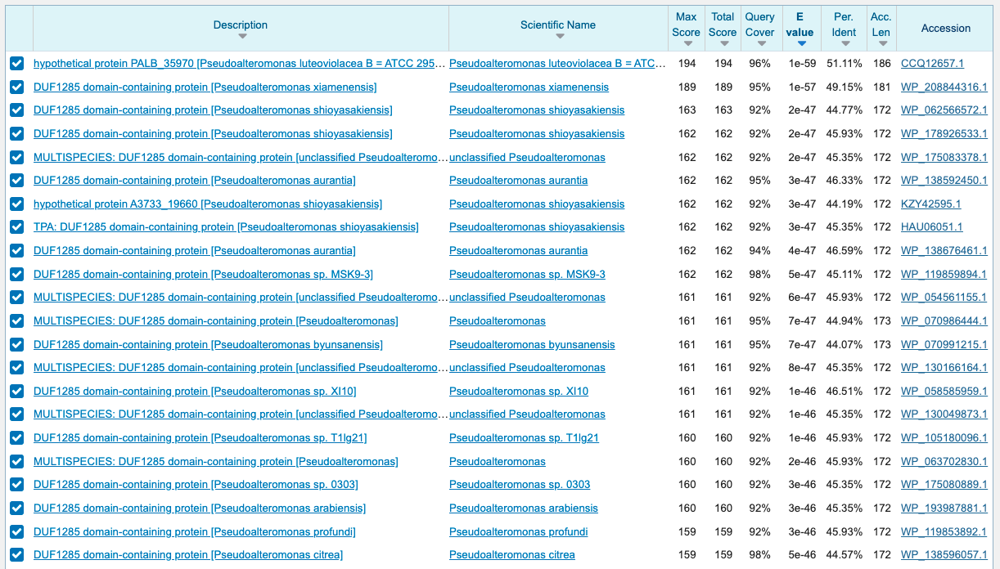
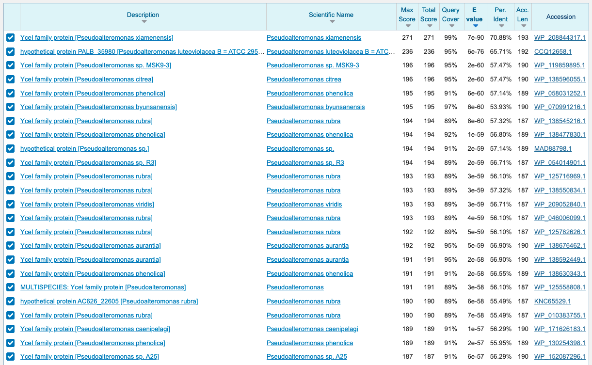
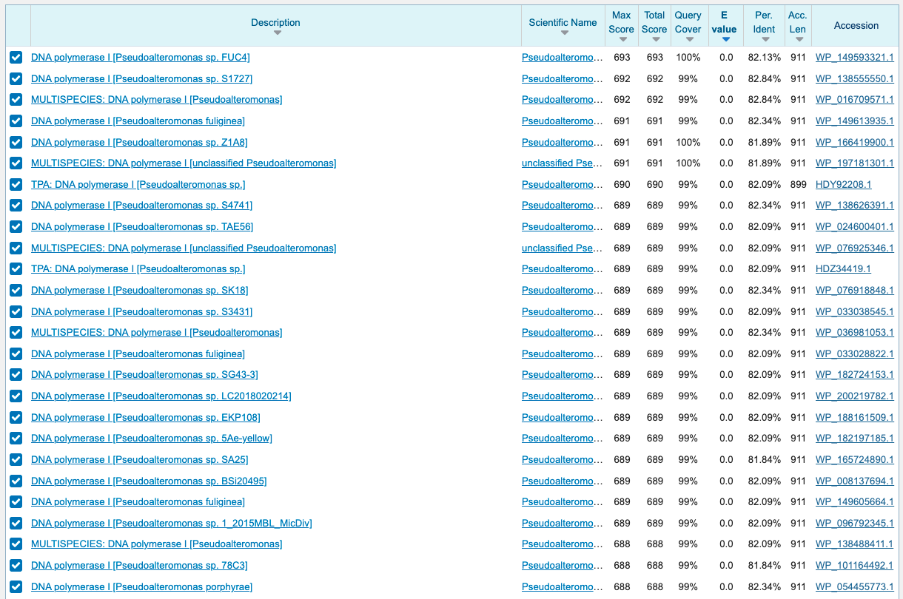
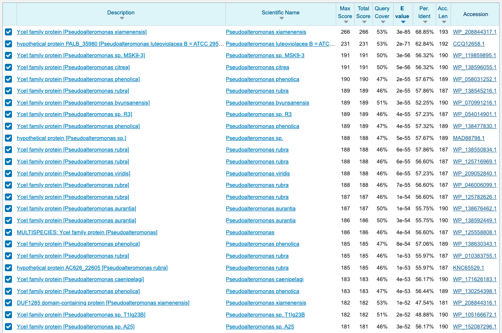
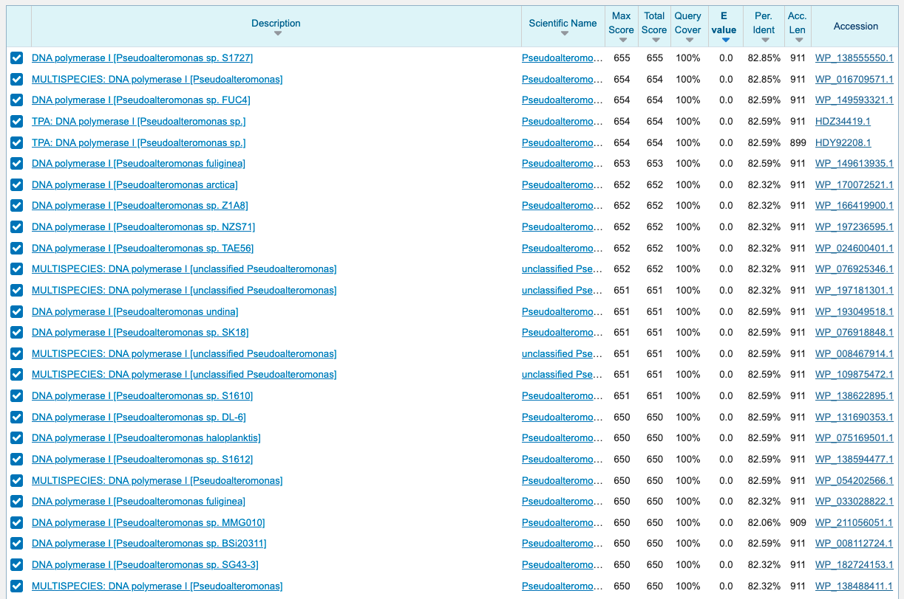
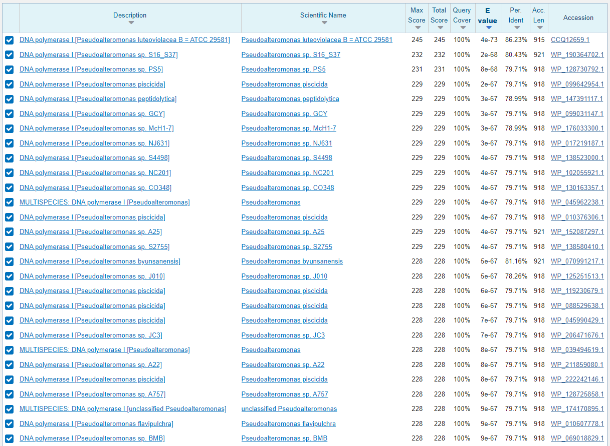
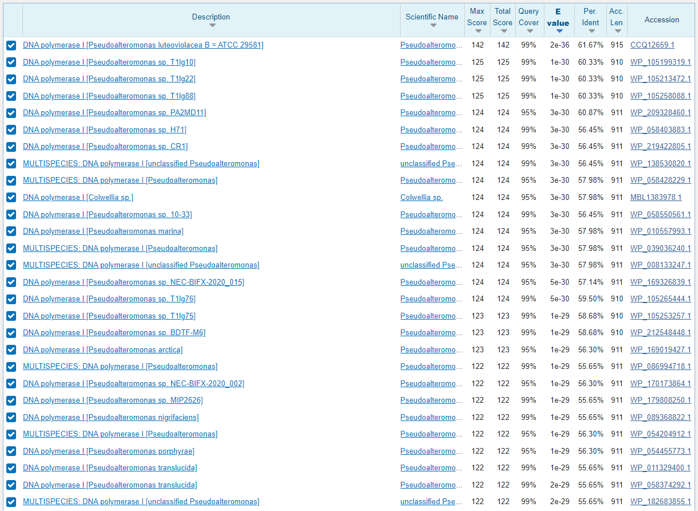
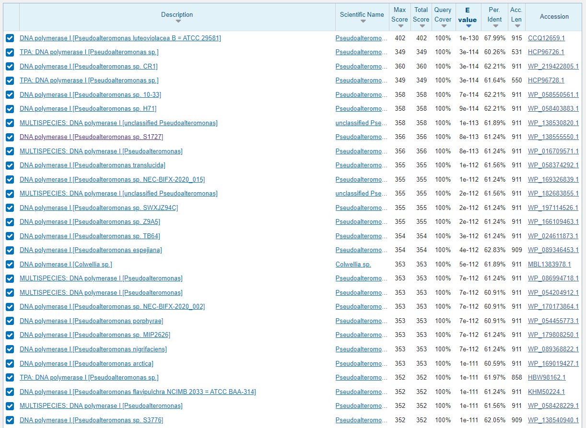
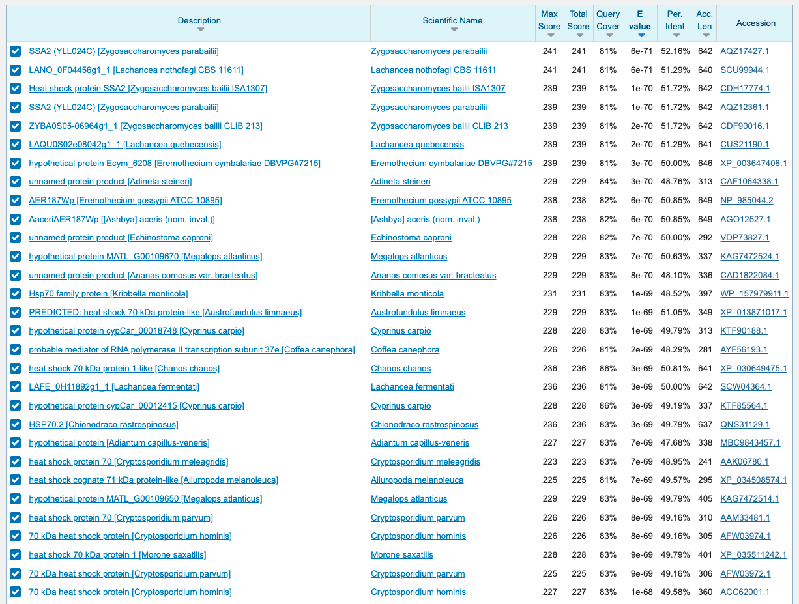
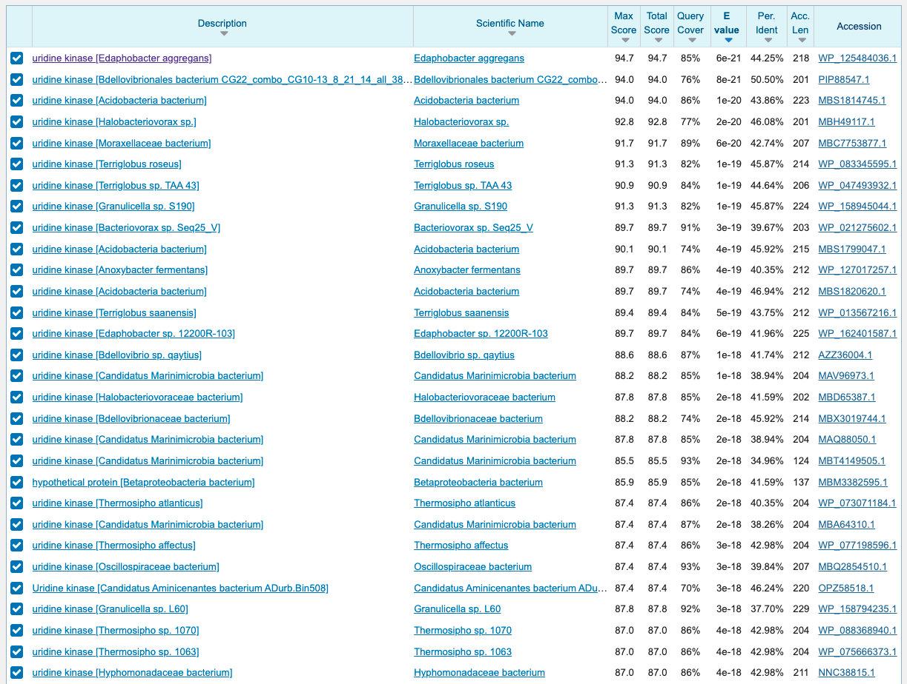

# Title

## Setup analysis directory

Link to *P. Ovals* genome, predicted proteins, and `kofamscan` results.

```bash
ln -s ../../../../../genome_data/Paulinella_ovalis_6_SingleCells/nuclear_genome/databases/Paulinella_ovalis_nuclear_SingleCell_ALL.assembly.fasta
ln -s ../../../../../genome_data/Paulinella_ovalis_6_SingleCells/nuclear_genome/databases/Paulinella_ovalis_nuclear_SingleCell_ALL.assembly.fasta.fai 
ln -s ../../../../../genome_data/Paulinella_ovalis_6_SingleCells/nuclear_genome/databases/Paulinella_ovalis_nuclear_SingleCell_ALL.assembly.fasta.augustus.pep.faa

ln -s ../../../../../Paulinella_ovalis/SingleCell_x6_Data_predict_genes/Paulinella_ovalis_nuclear_SingleCell_sag1.assembly.fasta.softmasked.augustus.gff3

ln -s ../../../../../genome_data/Paulinella_ovalis_6_SingleCells/nuclear_genome/process_data/kofamscan/Paulinella_ovalis_nuclear_SingleCell_ALL.assembly.fasta.augustus.pep.faa.kofamscan_results.detail.txt
```

Link to taxon diverse database used for phylogenetic analysis.

```bash
ln -s ../../../../../databases/db_from_Dana/XX-OTHER-FINAL.faa
```

Link to *P. chromatophora* `kofamscan` results.

```bash
ln -s /scratch/timothy/Paulinella_chromatophora_CCAC0185/GeneAnnotation/Paulinella_chromatophora_CCAC0185_Nuclear/Paulinella_chromatophora_CCAC0185_nuclear.pep.faa.kofamscan_results.txt
ln -s /scratch/timothy/Paulinella_chromatophora_CCAC0185/GeneAnnotation/Paulinella_chromatophora_CCAC0185_Plastid/Paulinella_chromatophora_CCAC0185_plastid.pep.faa.kofamscan_results.txt 
```

Link to *P. Chromatophora* crTP results that were published.

```bash
ln -s /scratch/timothy/genome_data/Paulinella_chromatophora_CCAC0185/nuclear_genome/crTP_containing_proteins/Paulinella_chromatophora_CCAC0185_nuclear_seqs_with_crTP.names.txt
```

Custom scripts to parse text files.

```bash
ln -s ../../../02_Scripts/add_value_to_table.py 
```

Setup bash environment.

```bash
conda activate py27
```

## Check if DNA replication proteins that are missing from KR01 are also missing from *P. Chromatophora*

Grep the missing IDs from both the nuclear and chromatophore results.

```bash
grep 'K02345\|K02344\|K02339\|K03471' Paulinella_chromatophora_CCAC0185_*.kofamscan_results.txt
```

```bash
Paulinella_chromatophora_CCAC0185_nuclear.pep.faa.kofamscan_results.txt:  Paulinella_chromatophora_CCAC0185_nuclear___scaffold11439-m78963  K03471  214.70   77.5   3.7e-21 ribonuclease HIII [EC:3.1.26.4]
Paulinella_chromatophora_CCAC0185_nuclear.pep.faa.kofamscan_results.txt:  Paulinella_chromatophora_CCAC0185_nuclear___scaffold19455-m108925 K03471  214.70   16.6     0.013 ribonuclease HIII [EC:3.1.26.4]
Paulinella_chromatophora_CCAC0185_nuclear.pep.faa.kofamscan_results.txt:  Paulinella_chromatophora_CCAC0185_nuclear___scaffold35010-m150289 K03471  214.70   29.4   1.7e-06 ribonuclease HIII [EC:3.1.26.4]
Paulinella_chromatophora_CCAC0185_nuclear.pep.faa.kofamscan_results.txt:  Paulinella_chromatophora_CCAC0185_nuclear___scaffold63711-m206400 K03471  214.70   11.4      0.49 ribonuclease HIII [EC:3.1.26.4]
Paulinella_chromatophora_CCAC0185_nuclear.pep.faa.kofamscan_results.txt:  Paulinella_chromatophora_CCAC0185_nuclear___scaffold7423-m59563   K03471  214.70   15.1     0.037 ribonuclease HIII [EC:3.1.26.4]
Paulinella_chromatophora_CCAC0185_nuclear.pep.faa.kofamscan_results.txt:  Paulinella_chromatophora_CCAC0185_nuclear___scaffold7423-m59562   K03471  214.70   22.9   0.00016 ribonuclease HIII [EC:3.1.26.4]
Paulinella_chromatophora_CCAC0185_nuclear.pep.faa.kofamscan_results.txt:  Paulinella_chromatophora_CCAC0185_nuclear___scaffold7732-m61220   K03471  214.70   92.8   8.3e-26 ribonuclease HIII [EC:3.1.26.4]
```

Only non-significant hits (below gathering threshold) were found in the nuclear proteins for K03471.

Check if these proteins are annotated with other functions.

```bash
grep -f <(grep 'K02345\|K02344\|K02339\|K03471' Paulinella_chromatophora_CCAC0185_*.kofamscan_results.txt | awk '{print $2}') Paulinella_chromatophora_CCAC0185_nuclear.pep.faa.kofamscan_results.txt
```

```bash
* Paulinella_chromatophora_CCAC0185_nuclear___scaffold11439-m78963  K10743  217.27  402.3  7.5e-120 ribonuclease H2 subunit A [EC:3.1.26.4]
* Paulinella_chromatophora_CCAC0185_nuclear___scaffold11439-m78963  K03470  129.57  130.3   3.3e-37 ribonuclease HII [EC:3.1.26.4]
  Paulinella_chromatophora_CCAC0185_nuclear___scaffold11439-m78963  K03471  214.70   77.5   3.7e-21 ribonuclease HIII [EC:3.1.26.4]
  Paulinella_chromatophora_CCAC0185_nuclear___scaffold11439-m78963  K07266   99.90   11.6      0.22 capsular polysaccharide export protein
* Paulinella_chromatophora_CCAC0185_nuclear___scaffold19455-m108925 K03120   43.20  345.3  2.3e-102 transcription initiation factor TFIID TATA-box-binding protein
  Paulinella_chromatophora_CCAC0185_nuclear___scaffold19455-m108925 K03471  214.70   16.6     0.013 ribonuclease HIII [EC:3.1.26.4]
  Paulinella_chromatophora_CCAC0185_nuclear___scaffold35010-m150289 K03470  129.57  123.4   4.1e-35 ribonuclease HII [EC:3.1.26.4]
  Paulinella_chromatophora_CCAC0185_nuclear___scaffold35010-m150289 K10743  217.27   52.4   1.4e-13 ribonuclease H2 subunit A [EC:3.1.26.4]
  Paulinella_chromatophora_CCAC0185_nuclear___scaffold35010-m150289 K03471  214.70   29.4   1.7e-06 ribonuclease HIII [EC:3.1.26.4]
  Paulinella_chromatophora_CCAC0185_nuclear___scaffold63711-m206400 K03470  129.57   38.4   3.2e-09 ribonuclease HII [EC:3.1.26.4]
  Paulinella_chromatophora_CCAC0185_nuclear___scaffold63711-m206400 K10743  217.27   18.2    0.0032 ribonuclease H2 subunit A [EC:3.1.26.4]
  Paulinella_chromatophora_CCAC0185_nuclear___scaffold63711-m206400 K03471  214.70   11.4      0.49 ribonuclease HIII [EC:3.1.26.4]
* Paulinella_chromatophora_CCAC0185_nuclear___scaffold7423-m59563   K03470  129.57  139.6   4.8e-40 ribonuclease HII [EC:3.1.26.4]
  Paulinella_chromatophora_CCAC0185_nuclear___scaffold7423-m59563   K10743  217.27   18.2    0.0033 ribonuclease H2 subunit A [EC:3.1.26.4]
  Paulinella_chromatophora_CCAC0185_nuclear___scaffold7423-m59563   K03471  214.70   15.1     0.037 ribonuclease HIII [EC:3.1.26.4]
  Paulinella_chromatophora_CCAC0185_nuclear___scaffold7423-m59562   K03470  129.57   56.9   7.2e-15 ribonuclease HII [EC:3.1.26.4]
  Paulinella_chromatophora_CCAC0185_nuclear___scaffold7423-m59562   K03471  214.70   22.9   0.00016 ribonuclease HIII [EC:3.1.26.4]
  Paulinella_chromatophora_CCAC0185_nuclear___scaffold7423-m59562   K10743  217.27   20.5   0.00066 ribonuclease H2 subunit A [EC:3.1.26.4]
  Paulinella_chromatophora_CCAC0185_nuclear___scaffold7732-m61220   K10743  217.27  130.7   2.3e-37 ribonuclease H2 subunit A [EC:3.1.26.4]
  Paulinella_chromatophora_CCAC0185_nuclear___scaffold7732-m61220   K03471  214.70   92.8   8.3e-26 ribonuclease HIII [EC:3.1.26.4]
  Paulinella_chromatophora_CCAC0185_nuclear___scaffold7732-m61220   K03470  129.57   76.3   9.1e-21 ribonuclease HII [EC:3.1.26.4]
  Paulinella_chromatophora_CCAC0185_nuclear___scaffold7732-m61220   K09420  449.43   22.4    0.0002 transcriptional activator Myb
  Paulinella_chromatophora_CCAC0185_nuclear___scaffold7732-m61220   K09453  353.90   15.9    0.0089 snRNA-activating protein complex subunit 4
  Paulinella_chromatophora_CCAC0185_nuclear___scaffold7732-m61220   K09423  282.93   13.7     0.079 Myb-like DNA-binding protein BAS1
  Paulinella_chromatophora_CCAC0185_nuclear___scaffold7732-m61220   K11649  380.10   13.1     0.081 SWI/SNF related-matrix-associated actin-dependent regulator of chromatin subfamily C
  Paulinella_chromatophora_CCAC0185_nuclear___scaffold7732-m61220   K09040  441.73   12.8      0.12 nuclear factor erythroid 2-related factor 1/3
  Paulinella_chromatophora_CCAC0185_nuclear___scaffold7732-m61220   K09517  356.80   10.6      0.49 DnaJ homolog subfamily B member 11
  Paulinella_chromatophora_CCAC0185_nuclear___scaffold7732-m61220   K22865  117.40    9.2      0.82 protein TALPID3
  Paulinella_chromatophora_CCAC0185_nuclear___scaffold7732-m61220   K11724 1128.70    8.9       1.3 bromodomain testis-specific protein
  Paulinella_chromatophora_CCAC0185_nuclear___scaffold7732-m61220   K11281  519.20    6.3       9.6 nucleosome assembly protein 1-like 3
  Paulinella_chromatophora_CCAC0185_nuclear___scaffold7732-m61220   K09425  196.47    4.9        63 Myb-like DNA-binding protein FlbD
```

All the proteins appear to be either K03470 (ribonuclease HII) or K10743 (ribonuclease H2 subunit A) or K03120 (transcription initiation factor TFIID TATA-box-binding protein). Which would explain why they have weak similarity to K03471 (ribonuclease HIII).

**The DNA replication proteins that are missing from KR01 are also missing from *P. chromatophora***

## Check if we have missed any *P. chromatophore* DNA Replication pathway proteins

Since we only extracted proteins from the phylogenetic analysis using the KR01 proteins it is best to double check that there are not any DNA Replication proteins annotated in *P. chromatophora* that we have missed.

```bash
grep 'K01972\|K02335\|K02342\|K03469\|K03470' Paulinella_chromatophora_CCAC0185_*.kofamscan_results.txt | sort -k3,3
```


## Check if any of the *P. chromatophora* that are annotated as DNA polymerase I (K02335) have a crTP.

Get proteins annotated as K02335.

```bash
grep 'K02335' Paulinella_chromatophora_CCAC0185_nuclear.pep.faa.kofamscan_results.txt
```

```bash
  Paulinella_chromatophora_CCAC0185_nuclear___scaffold18786-m106755 K02335  375.30  369.8  1.3e-109 DNA polymerase I [EC:2.7.7.7]
  Paulinella_chromatophora_CCAC0185_nuclear___scaffold19067-m107687 K02335  375.30   46.3   8.2e-12 DNA polymerase I [EC:2.7.7.7]
* Paulinella_chromatophora_CCAC0185_nuclear___scaffold2204-m25805   K02335  375.30  437.5  4.5e-130 DNA polymerase I [EC:2.7.7.7]
  Paulinella_chromatophora_CCAC0185_nuclear___scaffold410-m8010     K02335  375.30  154.8   1.3e-44 DNA polymerase I [EC:2.7.7.7]
  Paulinella_chromatophora_CCAC0185_nuclear___scaffold4340-m41193   K02335  375.30  356.8  1.2e-105 DNA polymerase I [EC:2.7.7.7]
  Paulinella_chromatophora_CCAC0185_nuclear___scaffold6139-m52383   K02335  375.30  338.2  4.8e-100 DNA polymerase I [EC:2.7.7.7]
```

Get crTP status of the K02335 proteins.

```bash
grep 'scaffold18786-\|scaffold19067-\|scaffold2204-\|scaffold410-\|scaffold4340-\|scaffold6139-' ../organelle_targeting_peptides/Paulinella_chromatophora_CCAC0185_nuclear.pep.faa.organelle_TP.txt
```

```bash
Eukaryota-Cercozoa-NA-Euglyphida-Paulinellidae-Paulinella_chromatophora_scaffold18786-size745_m.106755  No      No
Eukaryota-Cercozoa-NA-Euglyphida-Paulinellidae-Paulinella_chromatophora_scaffold19067-size735_m.107687  No      No
Eukaryota-Cercozoa-NA-Euglyphida-Paulinellidae-Paulinella_chromatophora_scaffold2204-size2588_m.25805   No      No
Eukaryota-Cercozoa-NA-Euglyphida-Paulinellidae-Paulinella_chromatophora_scaffold410-size4551_m.8010     No      No
Eukaryota-Cercozoa-NA-Euglyphida-Paulinellidae-Paulinella_chromatophora_scaffold410-size4551_m.8011     No      No
Eukaryota-Cercozoa-NA-Euglyphida-Paulinellidae-Paulinella_chromatophora_scaffold410-size4551_m.8013     No      No
Eukaryota-Cercozoa-NA-Euglyphida-Paulinellidae-Paulinella_chromatophora_scaffold4340-size1987_m.41195   No      No
Eukaryota-Cercozoa-NA-Euglyphida-Paulinellidae-Paulinella_chromatophora_scaffold4340-size1987_m.41193   No      No
Eukaryota-Cercozoa-NA-Euglyphida-Paulinellidae-Paulinella_chromatophora_scaffold6139-size1708_m.52383   No      No
```

**None of the genes in *P. chromatophora* that are annotated as DNA polymerase I (K02335) have a crTP.**

## Check the function of MSTRG.13387.1.p1, which is poorly placed in the DNA polymerase I tree

```bash
grep 'MSTRG.13387.1.p1' /scratch/timothy/tmp/tt.faa.kofamscan_results.detail.txt 
```

```bash
  MSTRG.13387.1.p1    K23786  350.07  143.9   3.6e-45 5'-3' exonuclease [EC:3.1.11.-]
  MSTRG.13387.1.p1    K01146  253.17  114.2   5.1e-36 protein Xni
  MSTRG.13387.1.p1    K02335  381.13   68.1   4.3e-22 DNA polymerase I [EC:2.7.7.7]
  MSTRG.13387.1.p1    K18950  133.53   56.3   1.9e-18 ribonuclease H [EC:3.1.26.4]
  MSTRG.13387.1.p1    K04799  263.00   17.7     1e-06 flap endonuclease-1 [EC:3.-.-.-]
  MSTRG.13387.1.p1    K20047  527.50   11.7   2.6e-05 actin cytoskeleton-regulatory complex protein PAN1
```

**Looks like MSTRG.13387.1.p1 is mostly likely not DNA pol I, although the best option, a 5'-3' exonuclease, is not above the gathering threshold for that protein**

## Analysis of *P. Ovals* protein in DNA polymerase I tree

The Paulinella_ovalis_nuclear_SingleCell___SAG1_utg7180000008502.g3975.t1 protein is positioned in a bacterial clade in the DNA polymerase I tree, close to MSTRG.27742.p1. Extract the other proteins on the utg7180000008502.SAG1 scaffold and BLAST them against RefSeq nr to see if they are also from bacteria. 

Get length of *P. Ovals* scaffold.

```bash
grep 'SAG1_utg7180000008502' Paulinella_ovalis_nuclear_SingleCell_ALL.assembly.fasta.fai
```

```bash
Paulinella_ovalis_nuclear_SingleCell___SAG1_utg7180000008502	3085	6343805	3085	3086
```

```bash
grep -A 1 'SAG1_utg7180000008502' Paulinella_ovalis_nuclear_SingleCell_ALL.assembly.fasta
```

>\>Paulinella_ovalis_nuclear_SingleCell___SAG1_utg7180000008502
>
>TGGACGTTGGACGACTGGTTTTTAGGGCCTTATGTTAAGCCTGAAGTTGAAAGTACTGACATCGAATAGTACCCCTTCGACATCCTTATTGGCGCGCTTGAGTAAAAAAGACTTAATCGCGCGCCATTAAAAAGCGCTTCCCCGCCGATTTCAGCCAATAGCCTTTTTCATCACTTTCCAGTAACTCTGCCCATTGGTAATAGACGTTGCGATGCACACGTGCCAACAAGCCATTGTTTAAAACCAAATAAGGTAAAGCGTCTTTTTGTACCTGCTTCTGGATGAGCGGATAACACTCACAGATAGGCCAATGGCGCTCTAAATTATCGATGGCTATCAGCACTTCATGACCATCCAGCATTTTTGATTGCCAATTGATAATCACAAAAGGCACATCCTCAACCGTAATTTCAATATCTTCAATTGGCGTCGTGAGATGATAAATACCGGGCGCTCGTTTGTCGCCTTCAGGATAATTAACGCGTAATACCGACGCCCACAACCTGACCATCGCATGACGTTTGACCATCGTCCCTTCATGCCACCATTGTCCGTTGCTATCAATGTGGATAGCTAATCGGCCGCAGTTTAAAGGCTGCCACTGTGCTTTTGGGCCAGTCGGCAGATTTAAGCTTGCAATATAAGCATTAAGTTCGGGATCAGCGGTGTTCATCGTTGAGTATCAGACTAATTAAGTTATCCATAGAGCAAAAAAAAGGGCGCATCAGCGCCCGACATGATTTATTTTTTCACTAAATTTAGCGACACCGATACCGGCACCGCTTGTGCGATTGAATCAAGACCTGCGACTTTACGTAAGGCTTCAATCCCCGCATCTAACGCAAAATCTTTGGCGTTGATTAGAATAGGCTTACGCGTTGAAACAAGCAGATCGTTACCCGCCTTAACGACATTCAGATCCAACAGCAAAGTGTGTGTCTTACCATGTAATGACAGGGTGGCTGGCACCTGACTGAGTTGATTTAAACCCGGCTTTAGTGCTCCAAGCTGCTTGCTCACCTCGGCCTTAACCGTTGCTTTTGGGAAGGCTGAAACTTCAAACAACATCTGTTGCATGCGTTCATTACGAATAGGGATCAGGCTTTCGACTGAAGCAAGCTCTATGGCAAACGACAGCTCACCCTGTGCTGAAAGTTGACCACCAAACTGTGTAAAATGGTGTGTTTCAGCGATGCTATTTTTCTTAATCGACACAAACTGAATGTCGCTCGTGCTTGAGTCTACTTGCCAATTGGCTAATGCATTAGGAGCAACAGCACTCGATACCAACATCAATCCCGCAACGAGAGTAGATTTAAACATGACGCTTTCCTTTTAATGTTCCGTACATAGAAGAAGAAATAAATCGAAATCTGCGAAGACTCTTTTTACTACCCTAACTTACGATTCAAATTGAAAAGTAGTTTACGAGGGATTTGCAGTGATTGCATCAATAAATAGGCAAAGAAATTAAGAGGCCGAGTTGAAAATGGTGAAAATGAAAAATGAAAAATGAAAATGGGACACGCAGATAAAAAAACGGCCCGCTTACGAGAGCGAGCCGGTATAGCAATCTGGGGAGAAGCTATCAATACGCTGTATCCTCAAAGAGAGATACATCATCAACAGGATGTCCTACAGGATAAGGACGGCGCGCACTGTAGCAAATAGCCATCCAGAAATAAACACTTCCAAGCAAAATTTAGGCCTATTTGATAAATTGGCTACATTAGATTTATAGCCCATTACATTTTCTTAAAATAGACCTCATTTTGTTAGTGTTTACATCGCAGCATCGGTTAATGCGCTTGTTGCCAGTTATCCCCACTGTCCGCCTCAACCAGTAACGGCACATCGAGTTTCGCCGCCCCTGACATCAGCTCACAAATTTTCAGCTTATACTCTTCTACCTTGTCCGAACGAATTTCAAACACCAATTCATCGTGTACTTGCATCAATAGTTTGATTTCGTCGGTTGTCGTTGATTTCAACCAAGCACTGACTGCAATCATTGCGCGTTTGATGATATCCGCAGCCGTGCCTTGCATTGGCGCATTGATAGCTGCACGCTCTGCCGCTTTTCGCGCCGCGCCATTACGTGCATTGATATCGGCTAAATACAAACGTCGACCGAATAAGGTTTCAACATAGCCTTTTTCAGATGCAGCGAGACGTGTGGTTTCCATGTATTCAAGTACACCAGGGAAGCGTTCGAAATACTTGTCGATGTAGTGCTGAGCTTCATGGCGCGGCACATCAAGTTGACGCGACAGGCCAAATGCCGACATACCGTAAATCAAACCAAAGTTAACGGCTTTCGCTTTACGACGCATATCACTGGTCACTTCCTCAAGTGGCACACCAAAGACTTCGGCCGCCGTCGCACTATGGACGTCTTGCCCTTGAGCAAAGGCATTAAGCAACCCTTTGTCTTGTGACAAATGCGCCATGATCCTAAGCTCAATTTGGCTGTAGTCGGCAGCGACAATTTGGTGACCTTCTGAGGCTATAAACGCTTCACGAATACGACGACCTTCCTCACTACGAATAGGAATATTCTGTAGGTTTGGATCGGTCGAGCTTAAGCGACCAGTGGCCGTAACCGCTTGATGATACGAGGTATGAACACGACCAGTGGTTGCGTTAACCATCAAAGGCAGCTTGTCTGTGTAAGTTGACTTAAGTTTAGATAAGCCGCGATGCTCCATGATCACTTTCGGTAGCGGGTAATCATGTGCCAGCTCTTGTAGCACTTCTTCTGCCGTTGACGGTGCGCCTTTAGGGGTTTTCTTGATGACTGGCAAACCGAGTTTATCAAACAAAATATGCTGTAATTGCTTGGTCGAGCTGAGGTTAAACGGCTCTTCGGCAATCTCAAACGCCATGTTTTCAAGTTCAACTAAACGCTCGGCAATGTGCTGGCTTTGCTTATTAAGCATCGCGGAATCAATCGCCACACCGGTACGTTCAACGTCCGACAATACGCTTAACAGCGGCAATTCAATGTCCATAAAGACTGATTTGAGACTGACTTCAGCTTCTAATTGCGGCCATAGTGTTTGATGCAAACGAAGTGTGATGTCGG

---

Get the proteins from *P. ovalis* that are on the scaffold of interest - **using the proteins that I predicted**. 

```bash
grep -A 1 'SAG1_utg7180000008502' Paulinella_ovalis_nuclear_SingleCell_ALL.assembly.fasta.augustus.pep.faa
```

```bash
>Paulinella_ovalis_nuclear_SingleCell___SAG1_utg7180000008502.g3973.t1
MNTADPELNAYIASLNLPTGPKAQWQPLNCGRLAIHIDSNGQWWHEGTMVKRHAMVRLWASVLRVNYPEGDKRAPGIYHLTTPIEDIEITVEDVPFVIINWQSKMLDGHEVLIAIDNLERHWPICECYPLIQKQVQKDALPYLVLNNGLLARVHRNVYYQWAELLESDEKGYWLKSAGKRFLMARD
>Paulinella_ovalis_nuclear_SingleCell___SAG1_utg7180000008502.g3974.t1
MLVSSAVAPNALANWQVDSSTSDIQFVSIKKNSIAETHHFTQFGGQLSAQGELSFAIELASVESLIPIRNERMQQMLFEVSAFPKATVKAEVSKQLGALKPGLNQLSQVPATLSLHGKTHTLLLDLNVVKAGNDLLVSTRKPILINAKDFALDAGIEALRKVAGLDSIAQAVPVSVSLNLVKK
>Paulinella_ovalis_nuclear_SingleCell___SAG1_utg7180000008502.g3975.t1
MDIELPLLSVLSDVERTGVAIDSAMLNKQSQHIAERLVELENMAFEIAEEPFNLSSTKQLQHILFDKLGLPVIKKTPKGAPSTAEEVLQELAHDYPLPKVIMEHRGLSKLKSTYTDKLPLMVNATTGRVHTSYHQAVTATGRLSSTDPNLQNIPIRSEEGRRIREAFIASEGHQIVAADYSQIELRIMAHLSQDKGLLNAFAQGQDVHSATAAEVFGVPLEEVTSDMRRKAKAVNFGLIYGMSAFGLSRQLDVPRHEAQHYIDKYFERFPGVLEYMETTRLAASEKGYVETLFGRRLYLADINARNGAARKAAERAAINAPMQGTAADIIKRAMIAVSAWLKSTTTDEIKLLMQVHDELVFEIRSDKVEEYKLKICELMSGAAKLDVPLLVEADSGDNWQQAH
```

Print location of genes along scaffold. 

```bash
grep 'SAG1_utg7180000008502' Paulinella_ovalis_nuclear_SingleCell_sag1.assembly.fasta.softmasked.augustus.gff3 | grep 'transcript'
```

```bash
Paulinella_ovalis_nuclear_SingleCell___SAG1_utg7180000008502	AUGUSTUS	transcript	113	673	0.64	-	.	ID=g3973.t1;Parent=g3973
Paulinella_ovalis_nuclear_SingleCell___SAG1_utg7180000008502	AUGUSTUS	transcript	742	1293	0.66	-	.	ID=g3974.t1;Parent=g3974
Paulinella_ovalis_nuclear_SingleCell___SAG1_utg7180000008502	AUGUSTUS	transcript	1800	3011	1	-	.	ID=g3975.t1;Parent=g3975
```

> Paulinella_ovalis_nuclear_SingleCell___SAG1_utg7180000008502.g3973.t1



> Paulinella_ovalis_nuclear_SingleCell___SAG1_utg7180000008502.g3974.t1



> Paulinella_ovalis_nuclear_SingleCell___SAG1_utg7180000008502.g3975.t1



**All proteins along SAG1_utg7180000008502 have top hits to *Pseudoalteromonas***

---

Get the proteins from *P. ovalis* that are on the scaffold of interest - **using the proteins that are in the taxon database**. 

```bash
grep -A 1 'SAG1_utg7180000008502' XX-OTHER-FINAL.faa 
```

```bash
>Eukaryota-Cercozoa-NA-Euglyphida-Paulinellidae-Paulinella_ovalis_SAG1_utg7180000008502.SAG1_utg7180000008502.g18.t1
MFKSTLVAGLMLVSSAVAPNALANWQVDSSTSDIQFVSIKKNSIAETHHFTQFGGQLSAQGELSFAIELASVESLIPIRNERMQQMLFEVSAFPKATVKAEVSKQLGALKPGLNQLSQVPATLSLHGKTHTLLLDLNVVKAGNDLLVSTRKPILINAKDFALDAGIEALRKVAGLDSIAQAVPWQPLNCGRLAIHIDSNGQWWHEGTMVKRHAMVRLWASVLRVNYPEGDKRAPGIYHLTTPIEDIEITVEDVPFVIINWQSKMLDGHEVLIAIDNLERHWPICECYPLIQKQVQKDALPYLVLNNGLLARVHRNVYYQWAELLESDEKGYWLKSAGKRFLMARD
>Eukaryota-Cercozoa-NA-Euglyphida-Paulinellidae-Paulinella_ovalis_SAG1_utg7180000008502.SAG1_utg7180000008502.g19.t1
MLNKQSQHIAERLVELENMAFEIAEEPFNLSSTKQLQHILFDKLGLPVIKKTPKGAPSTAEEVLQELAHDYPLPKVIMEHRGLSKLKSTYTDKLPLMVNATTGRVHTSYHQAVTATGRLSSTDPNLQNIPIRSEEGRRIREAFIASEGHQIVAADYSQIELRIMAHLSQDKGLLNAFAQGQDVHSATAAEVFGVPLEEVTSDMRRKAKAVNFGLIYGMSAFGLSRQLDVPRHEAQHYIDKYFERFPGVLEYMETTRLAASEKGYVETLFGRRLYLADINARNGAARKAAERAAINAPMQGTAADIIKRAMIAVSAWLKSTTTDEIKLLMQVHDELVFEIRSDKVEEYKLKICELMSGAAKLDVPLLVEADSGDNWQQAH
```

> SAG1_utg7180000008502.SAG1_utg7180000008502.g18.t1



>SAG1_utg7180000008502.SAG1_utg7180000008502.g19.t1



**All proteins along SAG1_utg7180000008502 from the proteins in the database have top hits to *Pseudoalteromonas*. Confirms that we saw previously.**

---

The Paulinella_ovalis_nuclear_SingleCell___SAG1_utg7180000023942.g10922.t1 protein is positioned in a bacterial clade in the DNA polymerase I tree, close to MSTRG.27742.p1. Extract the other proteins on the utg7180000023942.SAG1 scaffold and BLAST them against RefSeq nr to see if they are also from bacteria. 

Get length of *P. Ovals* scaffold.

```bash
grep 'SAG1_utg7180000023942' Paulinella_ovalis_nuclear_SingleCell_ALL.assembly.fasta.fai
```

```bash
Paulinella_ovalis_nuclear_SingleCell___SAG1_utg7180000023942   	1012   	17729131       	1012   	1013
```

```bash
grep -A 1 'SAG1_utg7180000023942' Paulinella_ovalis_nuclear_SingleCell_ALL.assembly.fasta
```

>\> Paulinella_ovalis_nuclear_SingleCell___SAG1_utg7180000023942
>CAAACGAAGTGTGATGTCGGCATCTTCGGCTGCGTAAAACGCCGCTTTTTCAAGTTCGATTTGATTGAAGGTCAGTTGGTTCTTCCCTTTACCTGCAATCTCCTCAAAACTTACTGTCTTATAACCTAAATACTTCAGTGCAAGCGAGTCCATATCATGGCGTGTTGCCACACTGTTAAGCACGTACGACTCCAACATGGTATCGAATGCTATGCCATCGAGCTCGATACCCGACTGCGCGAGCACACTCTTATCGTACTTCAGATTTTGACCAATTTTACCTAACGCTGGATCGGCTAAAATAGGCCCTAGATGAACTAACGCTTGCGCTAAACTCAACTGCTCTGGTGCGCCTACATAATCGTGCGCAAGCGGTAAATACGCTGCGTCACCTGGAGCAACTGCAAAGCTCATTCCGACCAATTTGGCTTGCATGTAATCCAAACTCGTCGTTTCAGTGTCAAATGCAAACAACTTCGCTTGTTTTTAACTTTCACACCACGCCAGCAACTGCGCTTCAGTCAAGATCGTTTCATAGTTTGCTTCGACAGCATCCGCCGAACTTGGCAGGCGGACCTCAGTTTGCTCATCTGAAGTGTTTGCATTAGTTGCTTTTTTGGCTGTTGCGCTACCATCAAGTAACTCCGCTAGCCAGCGCTTGAATTCACAGGCACCATAAAGAGCAATCAGCGCATCGTTATCCTGCGCTTTAAGTTCTAGGGTGTCTATTGGCTCAACCTCAACATCGAGTTTGATGGTTGCTAGTTGATAACTCAGTGGAAGTTGCTCTAACGCGCGCTGCAGCTTTTCACCAATTTTGCCTTTCACTTCACCCGCATGATCGATTACACCTTGTAACGAACCATATTGCTCAAGCCATTTTACTGCAGTCTTTGGTCCACAACCCTCAACACCGGAATGTTATCAACCTTATCACCCATCAGTGCTAAATAATCGATAATCAGTTCAGGCCCTACACCAAACTTCTCTTTTACACCTGCAGGATCTGAAA

Get the proteins from *P. ovalis* that are on the scaffold of interest - **using the proteins that I predicted**. 

```bash
grep -A 1 'SAG1_utg7180000023942' Paulinella_ovalis_nuclear_SingleCell_ALL.assembly.fasta.augustus.pep.faa
```

```bash
>Paulinella_ovalis_nuclear_SingleCell___SAG1_utg7180000023942.g10922.t1
MSFAVAPGDAAYLPLAHDYVGAPEQLSLAQALVHLGPILADPALGKIGQNLKYDKSVLAQSGIELDGIAFDTMLESYVLNSVATRHDMDSLALKYLGYKTVSFEEIAGKGKNQLTFNQIELEKAAFYAAEDADITLRL
>Paulinella_ovalis_nuclear_SingleCell___SAG1_utg7180000023942.g10923.t1
VIDHAGEVKGKIGEKLQRALEQLPLSYQLATIKLDVEVEPIDTLELKAQDNDALIALYGACEFKRWLAELLDGSATAKKATNANTSDEQTEVRLPSSADAVEANYETILTEAQLLAWCES
```

Print location of genes along scaffold. 

```bash
grep 'SAG1_utg7180000023942' Paulinella_ovalis_nuclear_SingleCell_sag1.assembly.fasta.softmasked.augustus.gff3 | grep 'transcript'
```

```bash
Paulinella_ovalis_nuclear_SingleCell___SAG1_utg7180000023942   	AUGUSTUS       	transcript     	1      	414    	0.93   	-      	.      	ID=g10922.t1;Parent=g10922
Paulinella_ovalis_nuclear_SingleCell___SAG1_utg7180000023942   	AUGUSTUS       	transcript     	487    	1012   	0.45   	-      	.      	ID=g10923.t1;Parent=g10923
```

> Paulinella_ovalis_nuclear_SingleCell___SAG1_utg7180000023942.g10922.t1



> Paulinella_ovalis_nuclear_SingleCell___SAG1_utg7180000023942.g10923.t1



**All proteins along SAG1_utg7180000023942 have top hits to *Pseudoalteromonas***

---

Get the proteins from *P. ovalis* that are on the scaffold of interest - **using the proteins that are in the taxon database**. 

```bash
grep -A 1 'SAG1_utg7180000023942' XX-OTHER-FINAL.faa 
```

```bash
>Eukaryota-Cercozoa-NA-Euglyphida-Paulinellidae-Paulinella_ovalis_SAG1_utg7180000023942.SAG1_utg7180000023942.g44.t1
GCGPKTAVKWLEQYGSLQGVIDHAGEVKGKIGEKLQRALEQLPLSYQLATIKLDVEVEPIDTLELKAQDNDALIALYGACEFKRWLAELLDGSATAKKATNANTSDEQTEVRLPSSADAVEANYETILTEAQLLAWCEIAPGDAAYLPLAHDYVGAPEQLSLAQALVHLGPILADPALGKIGQNLKYDKSVLAQSGIELDGIAFDTMLESYVLNSVATRHDMDSLALKYLGYKTVSFEEIAGKGKNQLTFNQIELEKAAFYAAEDADITLRL
```

> SAG1_utg7180000023942.SAG1_utg7180000023942.g44.t1



**All proteins along SAG1_utg7180000023942 from the proteins in the database have top hits to *Pseudoalteromonas*. Confirms that we saw previously.**


## Analysis of *P. Ovals* protein in Uridine kinase tree

The Paulinella_ovalis_nuclear_SingleCell___SAG1_utg7180000024255.g11047.t1 protein is positioned in a bacterial clade in the Uridine kinase tree, close to MSTRG.25663.1.p1. Extract the other proteins on the SAG1_utg7180000024255 scaffold and BLAST them against RefSeq nr to see if they are also from bacteria. 

Get length of *P. Ovals* scaffold.

```bash
grep 'SAG1_utg7180000024255' Paulinella_ovalis_nuclear_SingleCell_ALL.assembly.fasta.fai
```

```bash
Paulinella_ovalis_nuclear_SingleCell___SAG1_utg7180000024255	2539	17942551	2539	2540
```

```bash
grep -A 1 'SAG1_utg7180000024255' Paulinella_ovalis_nuclear_SingleCell_ALL.assembly.fasta
```

>\>Paulinella_ovalis_nuclear_SingleCell___SAG1_utg7180000024255
>
>AGGCAGGTATTTTAACTGGAGTCACATCAGATGCCACCGAGGATTTTGTTTTGATCGACGTGGCACCGCTATCCCTGGGAGTCGAAGCTGCAGGCGGGGCTATGTCAGTGATAATCCCCCGAAATTCAACTATTCCAGCGGTCGCAAAGAAGATGTATAGCACAAACGCTGACAACCAAACTGGTGTTGACATCCTGGTCTATGAAGGAGAACGAGCACGCACAAAAGACAACACCCTTCTTGCAAAATTTGAATTGGAAGGAATTCCACCTGCAGCCGCAGGAGTCCCAAGGATTGAAGTCTCATTCACCCTTGACGCATCGGGTATCTTGAATGTCTCAGCGGTTGAGAAATCGTCAGGTCAGGAGAAAAAAATCACTATAAACTCCGATCAAGTAAGGCTTAGCAAGGATGAGATTGATAAAATGGTGAAGGACGCAGAAAAATTTGCGCAGGAAGACATGCATCATCTGGAAAAAATTCAACTGAAAAATGAACTAGGAACTATGATTCGTGAGATGCGTGATTTTATTGAAGATAAAGACAATAAGATAAGCCTCAAAGACTATGAGACGATTCATAATGGTCTCATGAACATATCTTCATGGGTCGAGTACACCCCCAAAGCCACCAAGAAGGAGTACAAGGAACAAATTAAGTGGATTCAGGATGAGCTAGAGCCTATAGTTGCCGAGATTCTTTCTGGTAAGCGCCTGGCTGCAAAGAATATGGCGTCAGCTTTTAAGCAACTCAGGCGACGTGAAGTTCTTTTATTAGAAGCGAGTGAAGCGCACAATGCCAAGAGAATCAAGTGGACTCATATGGGCAGTGGAGGCAGCGAAAGTGGTGTTTGATTACATACTTCACATTATTGTTGTAACGATTCAGAATTAATTTAAAAAAATCACAAATATTTGAACATCAATTACCCTAATTAATTCGACTTAAATTATTTCTTGAGTTGAATTACTAGCAGCTAGTCGCTTTAGTACAGTAGTTGTATTACTGATAACTTTTACAGCAGTAAAGACTAAATCAAACTGACTATAAATCCCAGGAAGTAACTGAAGAAAATATTTACCGTCGCGTTTCTATAGCCTACTCGTTGAGACGCCTTTTGCGACCTGAATAAGAAACAAAGAGTGTATTCTAATCTAATCAAATCAATCGACTTTCAAAAGTTCACGAAATATCCCATCGAACACCAAGTAGTTTCTAATGACGGAAGGCAACTCTTTTGACGGAAGGCACATCATGAAGGTGCTGACTGGGTTACAAATAGGTGATTTTTTAATGGAAATAGAGTCACACCATCATACCAGATTCATCTTGTCCCGAATCTTCCGGGCAACTTCTTCTATGGCGCTACAGTAAAATTTGGTGCTGAAACATGACTTACGACTCGTTAGTTCATTCCAGCACACGCATACATACTAACTCACTCATACAAACAAAGACACACAACACTCTGACAACATGAAATATAATTTATATGTCGATAAGCGTGATTTTCTGCAAACGTCTACCTATTATTCCAGGTGTTCCAATCGACTACTACTTCTGCGTAAACTTTCTGTGGTTGCACATACTAGAAAGAGAGAAAAGAAAATACAGCATGAAATTCGCGAGATACATTGGATGTAACTAGTCTCGTTATAGAGAGGAGAATGAAGATAGGACACTAAATATTTCATTTCTAGCTTCCAGCTAAAATTTAAAGCATAAGATGCTAGAACCAACCATGTCATGCATCGGCTTAACATCACGCTGAAACTGCGCTTCAACCGATTCTTGGGTGCGTCCTGCACAAGTATGTGCAAGTGAAAGAACTTTGACCCCTCAATCGGTAGTCACGGATTTTTCTCGCTGCTACGAACCTCTTTCTCTGGTATCCCTGTCCGTTCGGCGCTTAAGTCGAGCCCCTTCTGTTGCGTCGATGAAAATTGTGAAGTCAAACAGTTTCCTGATACCTAGCCTGAGAGAAAAAATATCAGAGGAGTGAAAAGACAAATATTTTACTCAACGTAAAAATCGTCAGAGGGTAGATAGCTCGGTGACTGATGAATAAAATACTAATAGTATGCGTAGTCTATGAGTACTTCTGTGTCTAAAGATCTAGCCGGGCGGTGCACGAGAAAATGGAGACATAATATAAATAGGAAAAAATACAGAATGATCGTAGGTTACTCGTGCAATGAAAAAATGCCTTCCAGTAACATCACGCGCGCTGGATGAAGCTGCAACTTTTTGTCCTTAGGTGTCTTTGGAGTCACACGACTGTGTGAGACAAAATCGTACTGTGGAATATCGATCGACATTCCATAGGAAAGGCGCTGCAAAGCAAAAGTGAGTGGATGAGTTTCCTAACTCATGGTCTCAGAACTTCAGGTTTTGGCAAAAGAAACAGACAGTAGACTCAACTTTAAGAAAGCAATGACCTGTGTGTGCTTACGCATTAATTCAAAATCTATGGCATCTGGGTGATCAAAGTTCCGGCGGCCGCGCTCCTCCTAGAAAAAACAGAAAAATGAACGAGACT

---

Get the proteins from *P. ovalis* that are on the scaffold of interest - **using the proteins that I predicted**. 

```bash
grep -A 1 'SAG1_utg7180000024255' Paulinella_ovalis_nuclear_SingleCell_ALL.assembly.fasta.augustus.pep.faa
```

```bash
>Paulinella_ovalis_nuclear_SingleCell___SAG1_utg7180000024255.g11046.t1
AGILTGVTSDATEDFVLIDVAPLSLGVEAAGGAMSVIIPRNSTIPAVAKKMYSTNADNQTGVDILVYEGERARTKDNTLLAKFELEGIPPAAAGVPRIEVSFTLDASGILNVSAVEKSSGQEKKITINSDQVRLSKDEIDKMVKDAEKFAQEDMHHLEKIQLKNELGTMIREMRDFIEDKDNKISLKDYETIHNGLMNISSWVEYTPKATKKEYKEQIKWIQDELEPIVAEILSGKRLAAKNMASAFKQLRRREVLLLEASEAHNAKRIKWTHMGSGGSESGV
>Paulinella_ovalis_nuclear_SingleCell___SAG1_utg7180000024255.g11047.t1
MSIDIPQYDFVSHSRVTPKTPKDKKLQLHPARVMLLEGIFSLHELGIRKLFDFTIFIDATEGARLKRRTDRDTRERGRTQESVEAQFQRDVKPMHDMVVSTFMMCLPSKELPSVIRNYLVFDGIFRELLKVD
```

Print location of genes along scaffold. 

```bash
grep 'SAG1_utg7180000024255' Paulinella_ovalis_nuclear_SingleCell_sag1.assembly.fasta.softmasked.augustus.gff3 | grep 'transcript'
```

```bash
Paulinella_ovalis_nuclear_SingleCell___SAG1_utg7180000024255	AUGUSTUS	transcript	1	854	0.78	+	.	ID=g11046.t1;Parent=g11046
Paulinella_ovalis_nuclear_SingleCell___SAG1_utg7180000024255	AUGUSTUS	transcript	1164	2318	0.26	-	.	ID=g11047.t1;Parent=g11047
```

> \>Paulinella_ovalis_nuclear_SingleCell___SAG1_utg7180000024255.g11046.t1
>
> Eukaryota; Opisthokonta; Fungi; Dikarya; Ascomycota; saccharomyceta; Saccharomycotina; Saccharomycetes; Saccharomycetales; Saccharomycetaceae; Zygosaccharomyces



> \>Paulinella_ovalis_nuclear_SingleCell___SAG1_utg7180000024255.g11047.t1
>
> Bacteria; Acidobacteria; Acidobacteriia; Acidobacteriales; Acidobacteriaceae; Edaphobacter




## Double check that our crTP results match what was published

The file `Pchromatophora.crTP.txt` contains the *P. chromatophora* orthologs found from our phylogenetic analysis and weather we predicted they have a crTP using the KR01 HMM.

```bash
sed -e 's/-.*_/-/' Pchromatophora.crTP.txt | ./add_value_to_table.py -a <(awk '{print $1"\tcrTP"}' Paulinella_chromatophora_CCAC0185_nuclear_seqs_with_crTP.names.txt) | awk -F'\t' '$3~"crTP"'
```

```bash
scaffold885-m.13705 	Yes (198)	crTP
scaffold5116-m.46151	Yes (192)	crTP
scaffold4321-m.41082	Yes (198)	crTP
scaffold4328-m.41123	Yes (193)	crTP
scaffold2706-m.29779	Yes (193)	crTP
scaffold2706-m.29779	Yes (193)	crTP
scaffold8111-m.63166	Yes (194)	crTP
scaffold7938-m.62292	Yes (146)	crTP
scaffold7963-m.62412	Yes (196)	crTP
scaffold6901-m.56738	Yes (184)	crTP
scaffold6875-m.56608	Yes (197)	crTP
scaffold6875-m.56608	Yes (197)	crTP
```

**All proteins that we list in the Excel table were previously identified as having a crTP**


